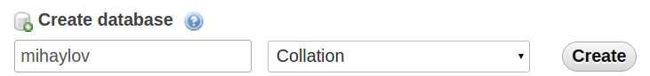
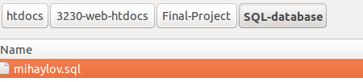
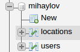
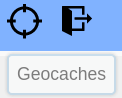

#CSCI 3230 Web Development Final Project

Contributors: Alex Mihaylov
              Truyen Truong

##Instructions:
1. Open `php.ini` which should be located in `/opt/lampp/etc/php.ini`
2. Change the following line to `file_uploads = On`
**There were some permission issues we had when the user tries to upload their own image to the database. Consequently the following files might need permission changes. We know this is not safe but since apache daemon process is the one adding the image, this is the only workable solution we found.**
3. sudo chmod 777 /tmp
In the Final project root folder:
5. sudo chmod 777 /img-res/geo-items/
Possibly this one if the above do not work (keep in mind it contains sessions variables)
4. sudo chmod 777 /img-res
6. sudo chmod 777 /opt/lampp/temp

###Setting up the database
Naivage to **phpMyAdmin** and click on the New button on the left

Type in **mihaylov** and click *Create*

Click on the database and in the top menu click **Import**

Click the Choose file button

From the main root folder in the project find **SQL-database** and click on the **mihaylov.sql** file

The database should now be imported and should resemble the structure shown below

You may also need to type the following SQL query to give the user access to the database

	CREATE USER 'alex'@'localhost' IDENTIFIED BY 'mypass';
	GRANT ALL ON mihaylov.* TO 'alex'@'localhost' identified by 'mypass'

###Navigating through the Site
Read through the front page for instructions on what the website is about and how to register and begin your adventure. Additionally you can browse through the **About** and **Contact** page for more information. This can be found by clicking on the coinslider in on the fron page or alternatively by clicking on the links in the footer at the bottom of the site.

With the database above there is a default user that can be used to log into and browse the login only pages. The login to use for testing is:

	username: testuser
	pass: test

You can also register your own login and password:

After registering it will automatically log the user in. if you wish to log in manually click the **Log in** button on the top banner and type in the username and password that were used to register with.

Once logged in, two button will become available. One that takes the user to the **Geocaches** page and the other is the **logout** button that can be clicked at any time to log out of the website.

In the Geocaches page the user can view the already listed geocaches by clicking them from the provided list. The user can also add their own geocache to the list of geocaches in the database.

Once the user has finished browsing around they can safely log out by clicking the logout button at the top right corner of the website.

##Assignment Structure and Criteria

The structure of the assignment: `tree -I 'images|jquery-local|img-res|*~|*.docx'`

	.
	├── about.php
	├── addGeo.php
	├── contact.php
	├── css
	│   ├── about.css
	│   ├── addGeo.css
	│   ├── coin-slider-styles.css
	│   ├── contact.css
	│   ├── hover-min.css
	│   ├── main.css
	│   └── mobile.css
	├── index.php
	├── js
	│   ├── addGeo.js
	│   └── core.js
	├── php
	│   ├── aboutchecklogin.php
	│   ├── aboutlogout.php
	│   ├── addImage.php
	│   ├── addImageToDB.php
	│   ├── addLocation.php
	│   ├── checklogin.php
	│   ├── contactchecklogin.php
	│   ├── contactlogout.php
	│   ├── dbconnect.php
	│   ├── getlocationJson.php
	│   ├── handleRegistration.php
	│   ├── logout.php
	│   └── uploadImageJson.php
	├── README.md
	└── SQL-database
		└── mihaylov.sql

##TOPICS COVERED
The below are files that include the topic or code snippets that demonstrate the usage of the concept

-------------
**HTML:** Files which include HTML concepts

    index.php
	about.php
	addGeo.php
	contact.php

-------------
**CSS:** Files which include CSS concepts

	about.css
	addGeo.css
	contact.css
	main.css
	mobile.css

-------------
**JavaScript:** Files which include javascript concepts

	addGeo.js
	core.js

-------------
**jQuery:** Files which use jQuery concepts

	addGeo.js
	core.js

-------------
**AJAX:** Code snippets demonstrating AJAX requests

*index.php:*

	<form id="loginForm" method="POST" action="php/checklogin.php">
	<form method="POST" action="php/handleRegistration.php">	

*addGeo.js:*

	$.post( "php/getlocationJson.php", { location_id: id})
	...
	$.post( "php/addLocation.php", { name: addName ...
	...
	$.ajax({
		url: "php/uploadImageJson.php",
		data: fileData,
		processData: false,
		contentType: false,
		type: 'POST'
	...
	$.post( "php/addImageToDB.php", { loc_id: locId, file: json.filename})

-------------
**Web services:** Code snippets demonstrating use of Google API

*addGeo.php:*

	

*addGeo.js:*

	var map = null;
	map = new google.maps.Map(document.getElementById("map"),{
	    center: {lat: parseInt(json.latitude), lng: parseInt(json.longatude)},
	    zoom: 8
	});
	...
	var marker = new google.maps.Marker({
		position: myLatLng,
		map: map,
		title: json.name
	});

-------------
**JSON:** Code snippets demonstrating use of JSON

*addGeo.js:*

	$.post( "php/getlocationJson.php", { location_id: id})
		.done(function( json ) {
	...
	$.ajax({
		url: "php/uploadImageJson.php" ...

*getlocationJson.php:*

	header("Content-type: application/json");
	...
	$stmt->bindValue(":lid",$_POST['location_id']);
	..
	//prepare the array to be sent as json
		$loc_array = array(
			"location_id" => $location_id,
			"name" => $name,
			"latitude" => $latitude,
			"longatude" => $latitude,
			"city" => $city,
			"country" => $country,
			"difficulty" => $difficulty,
			"rating" => $rating,
			"img_url" => $img_url
		);
	}
	echo json_encode($loc_array);
	...

*uploadImageJson.php:*

	$return_array = array(
		"completed" => "True",
		"filename"=> $target_file
	);
	...
	echo json_encode($return_array);

-------------
**PHP:** Files which demonstrate the use of php concepts

	about.php
	addGeo.php
	contact.php
	php/aboutlogout.php
	php/addImage.php
	php/addImageToDB.php
	php/checklogin.php
	php/contactchecklogin.php
	php/contactlogout.php
	php/dbconnect.php
	php/getlocationJson.php
	php/handleRegistration.php
	php/logout.php
	php/uploadeImageJson

-------------
**PDO:** Code snippets demonstrating the usage of PDO

*dbconnect.php:*

	$conn = new PDO("mysql:host=$dbhost;dbname=$dbname",$dbuser,$dbpass);

*index.php:*

	include_once "php/dbconnect.php"; //connect to the database
	$stmt = $conn->prepare("SELECT img_url FROM locations LIMIT 8");
	$stmt->execute();
	$stmt->setFetchMode(PDO::FETCH_ASSOC);
	$items = $stmt->fetchAll();

*addImageToDB.php:*

	$stmt->bindValue(":url",$filepath);
	$stmt->bindValue(":id",$locId);
	$stmt->execute();

*addLocaiton.php:*

	$stmt->bindValue(":name",$_POST['name']);
	$stmt->bindValue(":lat",$_POST['latitude']);
	$stmt->bindValue(":long",$_POST['longatude']);
	$stmt->bindValue(":city",$_POST['city']);
	$stmt->bindValue(":country",$_POST['country']);
	$stmt->bindValue(":diff",$_POST['difficulty']);
	$stmt->bindValue(":rating",$_POST['rating']);
pp	$stmt->bindValue(":url", $_POST['url']);

-------------
**SQL:**

*addImageToDB.php:*

	$stmt = $conn->prepare('UPDATE locations SET img_url=:url WHERE location_id=:id');

*getlocationJson.php*

	$stmt = $conn->prepare("SELECT * FROM locations WHERE location_id=:lid");

*checklogin.php*

	$stmt=$conn->prepare('SELECT user_id,email,password FROM users WHERE email=:em');

*addLocation.php*

	$stmt = $conn->prepare('INSERT INTO locations(location_id, name, latitude, longatude, city, country, difficulty, rating, img_url)

*handleRegistration.php:*

	$stmt = $conn->prepare('SELECT * FROM users WHERE email=:em');
	$stmt = $conn->prepare('INSERT INTO users(user_id, email,password) 

